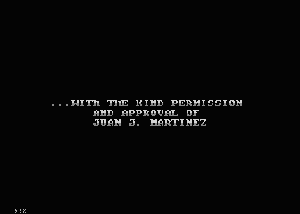
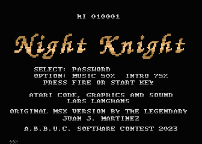
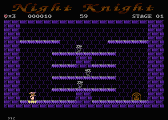
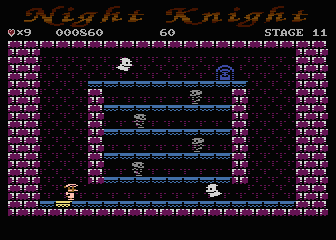
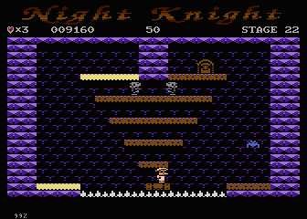
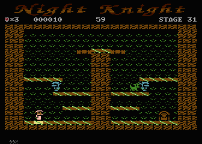
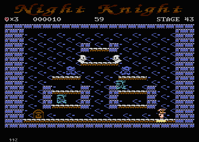
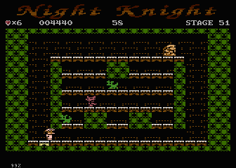
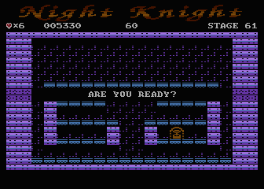
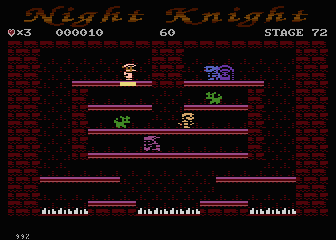

# Night Knight

**Original MSX version from Juan J. Martinez**

Here you find only the sources for the Atari 8bit port written by LarsImNetz.

**System requirements:** Atari XL/XE with at least 64 KB. Compatible with PAL and NTSC, mono and stereo Pokey.

Sir Bernard is cursed. The only way to get some sleep at night is to take a long walk through the enchanted castle!

Help the old knight break the curse by going through the castle and avoiding all the hostile creatures that dwell within the walls of Scarkeep.

Night Knight is a single-screen platformer with a strong classic arcade feel. Run against time. You have to run across all the tiles in the room, then take the key and go through the now open door to the next level.

The game has 80 levels and is controlled with a joystick.

Press 'SPACE' to pause/resume the game and a password for the current level will be displayed.

Press ESC to exit the game.

## Things

**The key** appears after all the floor tiles in the room changed it's color. It must be collected so that the exit door to the next level opens.

**The hourglass** resets the time, useful when the standard time is not enough.

**The shield**, if collected, protects the knight for exactly one hit. In addition, it provides immunity for a few seconds. Useful in difficult situations.

**The Stopwatch** stops time for a few seconds and freezes all enemies on the stage. Nevertheless, the enemies should not be touched.

**The gems** are scattered throughout the castle and should be collected for additional points. Sir Bernard gets an additional life every 3,000 points. You will need it.

## The monsters

**The undead** wander the dark corridors of the castle as if they were still alive. They are easy to get around.

**The Archers** are the common guards of Scarkeep. They patrol a designated area and shoot arrows at you with their long bows. A good strategy is to avoid their line of sight or give yourself some space to jump over the arrows.

**The Dark Knight** walk and jump around in their shining armor. You are not limited to a specific area and move freely around the stage. Be careful because they might decide to jump to the level you are on.

**The Ghosts** are lost souls flying around the castle. Walls cannot stop their ethereal presence, so keep an eye on them at all times.

**The Vampire** the Lord of the Night, he can switch between two different forms: a walking humanoid and a flying giant bat that searches for victims to suck their blood.

**The Wizard** a magical resident with the power to undo your progress. He can return the floor tiles to normal, meaning you have to walk across those tiles again. It is advisable to go through the area covered by the wizard last, as he will no longer change the color of the floor tiles once the key appears.

**The Werewolf** half human, half wolf. He moves freely around the stage and can attack you from below with his keen senses when he perceives you at a higher level. You can use his instincts against himself, lure him to an upper level and quickly go down yourself.

**The Witch's Cat** a magical creature. The cat does what it likes. She can move freely and quickly changes levels with magic, so always be ready to jump to the side if the cat is below or above you!

## The Game

The most parts of the game are written in my Action! equal high-level compiler language! The language does not have the limitations of Action!. I can make full use of the Atari's 62kb RAM.

* The task in the game is simple, touch each corresponding floor once, then collect the key and then escape through the opened door to the next level.
* There are 80 different levels.
* All opponents want to kill you.

As 1ng always says, there are no problems, only challenges.
* How do you put more than 4 sprites on the Atari? Shanti77/tebe programmed something that I rewrote for the game. I'll really introduce that soon. With this code I can freely position up to 16 sprites and also animate them differently. It only flickers when there are more than 4 sprites in one line. You only need to set 4 bytes per sprite. And lots of displaylist interrupts.
* How to get 80 levels into memory without reloading? I would say, either put it together cleverly through block formation and then copy & pasta, or brute force with RLE/Huffman. I used the 2nd method. 8-) The 80 levels need almost 9kb of RAM. The packer is already used in my Pacmen evolution game.
* The different things each opponent does were a bit fiddly. But that's almost all solved.
* The collision query is also a thing, since I don't really know which sprite collides with which sprite, I use the built-in collision detection here with a few additional tricks.
* A password generator was needed, I simply looked at md5sum and wrote a small version of it for the Atari 8bit.
* As usual with my current games there is of course a GodMode, but this time there are only 99 lives. My son then played through the first 60 levels until he ran out of lives.
* I gave my high-level language a few additional optimizations so that the code doesn't get too big and stays fast.
  *Unfortunately the Atari doesn't have high-res sprites like the MSX or C64, so everything looks a bit wider, but it looks nice.

## Some Level Pictures

There exist 80 levels in 8 different designs, here are some sample pictures:

Every level has a size of 966 bytes. 6 Byte header and 40 bytes width and 24 lines height.

## Build the game from scratch

To build the game disk, stay in root folder and execute `make` from a unix-shell, **but** there are some _preconditions_.
On Windows use git-bash. On Linux a shell like bash.

### Preconditions to build

You need some stuff for build from scratch

* A PC with a unix based environment like Linux or Windows with mingw. Maybe a Mac. I prefer a Linux box.
* Bash Shell **/bin/bash**
* **make** for the Makefile

To initialise the most of the environment just start `make init` this will start the script `get-everything.sh`

#### To build this source from scratch

* Make sure you have at least **OpenJDK 11** installed. The compiler and other tools need Java.

* [**lla.xldir.disktool**](https://github.com/the-atari-team/lla.xldir.disktool)
  * for read/write access to ATR disk images
  * get the _ready to use_ xldir.jar out of the [release development build](https://github.com/the-atari-team/lla.xldir.disktool/releases/download/latest/xldir.jar)
  
* [**wnf.compiler**](https://github.com/the-atari-team/wnf.compiler)
  * to compile .wnf files to 6502 assembler
  * get the _ready to use_ wnf-compiler.jar out of the [release development build](https://github.com/the-atari-team/wnf).compiler/releases/download/latest/wnf-compiler.jar
 
* [**tat.packer**](https://github.com/the-atari-team/tat.packer)
  * to compress the level data by RLE & Huffman
  * get the _ready to use_ xl-packer.jar out of the [release development build](https://github.com/the-atari-team/tat.packer/releases/download/latest/xl-packer.jar)

* [**atasm**](https://github.com/CycoPH/atasm) the 6502-cross-assembler, to create COM-files out of ASM-files,
because the wnf.compiler only creates assembler files. You need at least Version 1.23!
 
* the [**ATARIXL.ROM**](http://www.emulators.com/freefile/pcxf380.zip), copy the XL-OS to `../firmware` folder.
 
* [**atari800**](https://atari800.github.io/index.html) Emulator is need. Make it available via $PATH variable.

If everything above is installed, just call `make start` from the root of this repository to compile the game, create the image and start it in atari800 emulator.

If you would like to debug the code, use the [**Altirra**](https://virtualdub.com/altirra.html) Emulator and start `make debug` on console. In the Makefile find in line 5 the ALTIRRA= expressions, set it to your installed Altirra version. Here you can see how to use it with Wine in a Linux environment.

